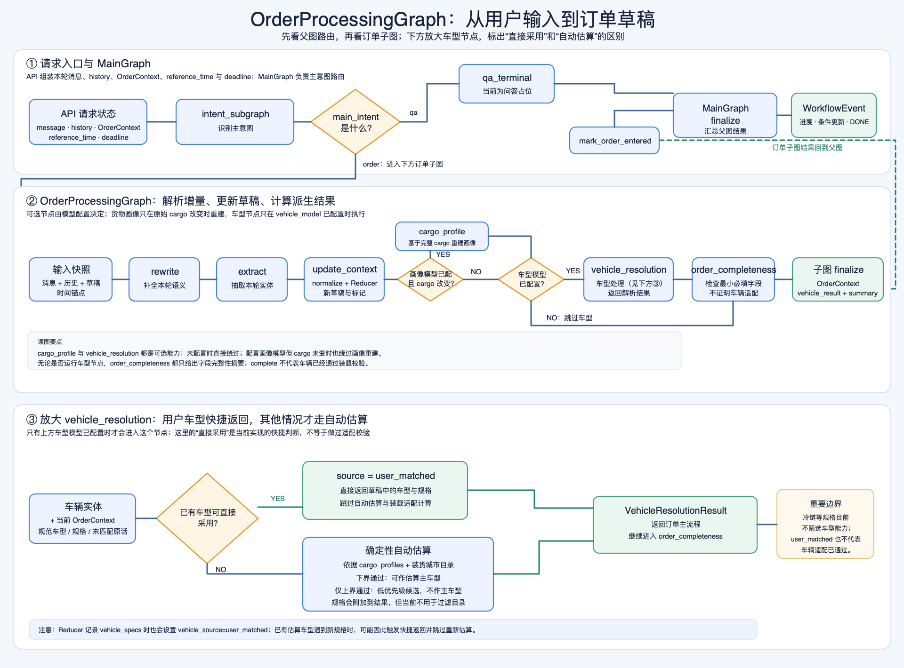

# InOrder 技术面试准备：从项目介绍到深度追问

> 本文按 2026-09-26 的仓库代码整理。`已实现`、`可配置`、`尚未实现`分别表示代码能力、依赖部署配置的能力和仍在规划中的能力。文中的示例用于解释流程，不代表一次真实模型调用的固定输出。
>
> 练习方式：先只读每节的“面试追问”，自己说出答案，再看“自查要点”。把自己的实际贡献和真实部署经历填在最后一节；不要把项目已有代码自动说成自己独立完成的工作。

## 1. 先把项目讲准

InOrder 是物流拉货场景的**订单语义解析原型**。Python 接收本轮消息、对话历史和当前订单草稿，识别这是下单需求还是咨询；对下单需求，抽取本轮增量信息并更新 `OrderContext`，然后估算货物约束、筛选车型候选、检查订单字段是否齐全。HTTP 接口以 SSE 返回处理进度和结果。

它目前没有执行订单创建、支付、历史订单查询或 Java 侧持久化。`order_summary.status=complete` 只表示当前最小语义字段齐全，不表示订单已经创建或车辆已经调度。

| 能力 | 当前状态 | 面试时的准确说法 |
| --- | --- | --- |
| 主意图分类、订单语义解析、订单草稿更新 | 已实现 | 一次请求内完成解析和上下文合并 |
| 货物画像、车型候选、订单完整性摘要 | 已实现 | 基于估算和本地/可选远端目录做初筛 |
| 车型目录 RPC | 可配置 | API 设置 `VEHICLE_CATALOG_RPC_URL` 才请求远端；失败可用缓存或本地目录 |
| Java 会话/订单持久化、真实下单 | 尚未实现于本仓库 | 调用方需保存并传回历史和订单草稿 |
| 真实问答 | 尚未实现 | `qa` 目前到占位终态 |

**30 秒版本：**

> 我做的是物流下单前的语义处理：把用户多轮自然语言转成结构化订单草稿，再根据货物画像和车型能力范围给出候选。LangGraph 负责意图路由和订单处理编排，模型负责理解和估算，字段合并与车型筛选交给确定性代码。当前只到订单准备阶段，没有执行真实下单。

**90 秒版本：**

> InOrder 接收本轮消息、历史和已有订单草稿。父图先区分 `order` 与 `qa`；订单分支先用 Rewrite 把“再加一吨”“换成明天下午”这种依赖上下文的表达写清楚，再由 LangExtract 提取带动作的实体。归一化和纯函数 reducer 把动作合并到新的 `OrderContext`。货物发生变化时重新生成完整货物画像，随后用车型载重、体积和尺寸的上下界及简化极点装载算法筛选最多三个候选。API 使用异步图流、有限并发和节点级 SSE。它的边界也很明确：模型画像是估算，车型不是物理装载保证，真实订单创建和跨请求持久化由外部系统负责。

> **面试追问 01｜先口述 60 秒：** 为什么你把它叫“订单语义解析原型”，而不直接叫“AI 下单系统”？
>
> **自查要点：** 说清输入、`OrderContext`、车型候选、`order_summary`；明确 `complete` 和真实订单创建的区别；不要虚构 Java 集成或线上订单指标。

## 2. `OrderProcessingGraph`：一条请求怎样变成订单草稿

这一节按三个顺序讲：先看请求从入口到返回的全链路，再用一条真实感较强的消息走一遍，最后拆开每个节点说明它读什么、改什么、为什么单独存在。

### 2.1 先看完整流程



图分三层。顶部是 API 和父图 `MainGraph`；中间是订单子图；底部放大车型节点内部。要沿着“请求输入 → 主图路由 → 订单子图 → 父图汇总 → `SSE` 返回”读，车型分支则解释用户写了车型要求后代码具体怎么处理。

API 先校验请求，并组装本轮 `message`、`history`、`OrderContext`、`reference_time` 和 `deadline`。`MainGraph` 的 `intent_subgraph` 识别主意图：`qa` 进入当前的问答占位节点，然后由父图 `finalize` 汇总；`order` 才进入 `OrderProcessingGraph`。

订单子图按顺序执行 `rewrite` → `extract` → `update_context`。接着看两个配置条件：如果配置了画像模型且原始 `cargo` 发生变化，就运行 `cargo_profile`；之后如果配置了车型模型，就运行 `vehicle_resolution`。两者都未配置时会直接跳过；只有画像模型已配置但 `cargo` 未变化时，也会跳过画像重建。车型节点完成后，`order_completeness` 检查最小订单字段，子图 `finalize` 收集 `OrderContext`、车型结果和完整性摘要。

子图结果交回 `MainGraph` 后，父图执行 `mark_order_entered` 和 `finalize`，最后 `WorkflowEventAdapter` 将图执行过程转成节点进度和 `DONE` `SSE` 事件；只有最终 `order_context_updated=true` 时，才会发送 `CREATE_ORDER_CONTEXT`。这个标记有一个车型估算分支的覆盖边界，后文会说明。错误或超时走 `ERROR` 事件，不会把失败伪装成订单处理成功。当前 API 不会创建真实订单。

这张图也回答了“旧图有没有错”：旧图的 `rewrite`、`extract`、`update_context` 主线顺序基本对，但把车型节点画成一个普通步骤，漏掉了“已有可采用车型时直接返回”的快捷分支，也没有清楚画出订单子图返回父图后的汇总。因此旧图只能说明大致节点，不能作为完整控制流图。

整条链路最容易混淆的是：识别出车型实体，不代表系统检查过这辆车能不能装。车型节点内部会先判断是否直接沿用草稿中的规范车型；这条路径返回 `source=user_matched`，不运行自动估算。只有不能直接采用时，才根据货物画像和装货城市目录做确定性车型估算。

### 2.2 用一个例子走完整程

假设旧 `OrderContext` 已有装货地上海、卸货地杭州、送达时间“明天下午”、苹果 1 吨。本轮用户说：

> 装货地改到温州，苹果再加五百公斤；车型选 4 米 2，要求冷链。

为了讲清节点职责，先假设抽取结果正确：装货地是 `set`，苹果五百公斤是 `add`，车型和冷链规格都通过归一化。实际 LLM 可能给出不同实体；下面关注实体进入图之后发生什么。

1. `MainGraph` 识别为 `order`，把请求交给订单子图。
2. `rewrite` 结合旧草稿理解“再加”是增量，并将本轮语义整理为 `extraction_text`；`extract` 据此得到本轮四个实体。到这里，旧草稿还没被修改。
3. `update_context` 复制旧草稿，归一化实体并应用动作：装货地改为温州，苹果重量明细变为“一吨”和“五百公斤”两条；车型存为规范车型码，规格存为 `cold_chain`。因为原始 `cargo` 列表改变，`cargo_updated=true`。
4. 如果画像模型已配置，`cargo_profile` 会从这两条完整的重量明细重新计算整批苹果画像，而不是在旧画像上再加五百公斤。
5. 如果车型模型已配置，`vehicle_resolution` 发现当前草稿已有匹配成功的车型，于是返回 `source=user_matched`。它不调用估算器，所以不会核验 4 米 2 是否装得下，也不会核验它是否支持冷链。冷链规格被记录，但当前没有参与目录筛选。
6. `order_completeness` 检查装货地、卸货地、货物名称、重量或数量、送达时间。例子中的五项都已存在，摘要会是 `complete`；这表示字段齐全，不表示车辆适配通过。
7. 子图 `finalize` 返回结构化结果，`MainGraph` 再汇总，`WorkflowEventAdapter` 发送 `SSE`。处理到这里仍只是订单草稿，没有创建或持久化真实订单。

如果本轮只有“冷链”规格、草稿中没有车型，车辆节点会走自动估算，再把识别出的规格附加到结果；但冷链目前仍不筛选候选。如果用户说“大车”而无法归一化为具体车型，原话会出现在估算原因中，系统按货物画像继续估算。估算结果里，下界通过的车型才可能成为主车型；仅上界通过的车型只作为低优先级候选。

> **面试追问 02｜例子推演：** 这笔订单为什么会重建画像？为什么用户说了 4 米 2，代码反而不检查能否装下？如果只识别出冷链要求，结果又有什么不同？
>
> **自查要点：** `cargo` 改变触发全量画像重建；已有规范车型会走 `user_matched` 快捷返回；只有规格且没有可沿用车型时才自动估算，规格当前不筛车型。`complete` 只表示订单字段齐全。

### 2.3 再逐节点解释数据如何流动

**第一段：把上下文变成本轮实体。** `rewrite` 读取本轮消息、`history`、旧 `OrderContext` 和 `reference_time`，输出 `rewritten_text` 与 `extraction_text`。它只整理语义，不直接写草稿。`extract` 默认通过 `LangExtract` 将 `extraction_text` 拆成带类型、动作和属性的实体，例如“苹果、`add`、五百公斤”。两步分开，是为了让模型先理解上下文，再只抽取本轮动作，减少旧字段被重复累计的风险。

**第二段：用规则生成新的订单草稿。** `update_context` 调用 `normalize_entities` 统一时间、枚举和车型等值，再让 `OrderContextReducer` 在副本上应用 `add`、`set`、`remove`、`replace`。归一化未接受的车型不会写入规范车型字段。`Reducer` 返回新 `OrderContext`，并产生两个不同标记：`order_context_updated` 表示草稿是否变化；`cargo_updated` 只比较原始 `cargo` 列表。因而只改地址不会触发画像重算，处理失败也不会把半成品写进调用方传来的旧对象。

**第三段：按条件计算派生结果。** `cargo_profile` 只在画像模型已配置且 `cargo_updated=true` 时运行；它读取完整原始 `cargo`，更新 `cargo_profiles` 和 `cargo_profile_summary`。画像是估算数据，不是称重结果。`vehicle_resolution` 只在车型模型已配置时运行，它接收画像、汇总值和有效装货城市；它是基于目录及能力上下界的确定性计算，不是 LLM 直接挑车。

车型节点有两条结果路径：

- **直接沿用草稿车型：** 当前草稿有规范 `vehicle_type`、没有未匹配的车辆表达，并满足代码的来源判断时，直接返回 `source=user_matched`。它不会调用估算器，也不会检查载重、体积、尺寸或车型规格是否满足。
- **自动估算候选：** 没有可直接采用的车型时，依据 `cargo_profiles`、货物汇总和装货城市对应的目录计算。下界通过的候选可以成为 `estimated` 主车型；只有上界通过的候选保留为低优先级候选，不作为主车型。已识别的 `vehicle_specs` 会并入结果，但当前不会拿来过滤车型目录。未匹配车型原话只进入原因说明，不会被当成规范车型约束。

还有一个代码边界要诚实说明：`Reducer` 处理已识别 `vehicle_specs` 时也会把 `vehicle_source` 标成 `user_matched`。因此，旧草稿已有估算车型时，本轮只增加规格，也可能让车型节点把旧车型当作可沿用结果并跳过重算。这个快捷判断依据当前草稿与车辆实体状态，不严格等同于“用户本轮刚选了车型”。

SSE 的订单上下文事件也依赖最终的 `order_context_updated` 标记。自动估算分支会用“车型节点前后的上下文是否变化”重新计算这个标记；如果前面的 Reducer 已改了草稿、车型节点随后没有再改上下文，这个新值可能覆盖先前的 `true`，导致 `CREATE_ORDER_CONTEXT` 没有发出，而最终 `DONE` 仍带有草稿。因而应把它说成“按最终标记发送”，不能说每次草稿变化都会稳定触发该事件。

**第四段：检查字段并返回结果。** `order_completeness` 根据最终草稿检查装货地、卸货地、货物名称、重量或数量、送达时间，并生成 `missing_required` 与 `next_prompt`。车型不是必填项，车辆适配也不是 `complete` 的判定条件。子图 `finalize` 汇总 `rewrite_result`、`entities`、新草稿、车型结果和 `order_summary`；`MainGraph` 随后记录订单分支已进入并完成父图汇总，适配器再输出 `SSE`。

这样的拆分让每一层只负责一类判断：模型理解语言并抽取实体，归一化控制数据格式，`Reducer` 决定字段怎样变化，画像和车型算法计算派生信息，完整性节点给出还缺什么。代价是节点之间必须维护清楚的状态字段与数据约定。

> **面试追问 03｜架构题：** 为什么不让一个 LLM 直接读对话并生成完整订单和车型？哪些判断适合模型，哪些必须由规则或确定性计算负责？
>
> **自查要点：** 模型负责语义理解、实体抽取与货物画像；状态合并、车型能力上下界比较和字段完整性由代码控制。拆分便于验证和定位错误，也增加了状态契约的维护成本。

## 3. 多轮会话由谁保存，如何处理“继续”

Python API 不按 `session_id` 查询数据库或恢复订单。调用方要保存上轮返回的完整 `history` 和 `order_context`，下一轮再传入；`session_id` 用于请求标识和返回关联。仓库内置测试页把这些状态存在浏览器内存，刷新后即丢失；CLI 则保存在当前进程内。

入口有一个**请求内的会话恢复**：如果传入历史在最后一条 assistant 之后还留有未完成的 user 消息，本轮说“继续”“重试”，会将这些待处理文本合并成这次要解析的消息，并在成功的 `DONE` 中返回新的历史快照。这解决的是“上轮用户文本已经写入历史，但没有得到 assistant 回复”的输入整理，不是跨请求业务幂等，也不会让外部创建订单自动只执行一次。

`reference_time` 是相对时间解析的锚点，优先级为：

1. `order_context.reference_time`；
2. 请求中的 `reference_time`；
3. 入口按 `Asia/Shanghai` 生成的当前时间。

它在本次请求中只确定一次，传给 Rewrite、Extract 和格式修复调用。下一轮应随完整 `OrderContext` 一起传回。这样“明天”不会因为重试跨过午夜就变成另一日；但对用户真实意图的解释仍依赖抽取结果。

> **面试追问 04｜故障题：** 客户端在发送“再加一吨香蕉”后断线，历史中留下这条 user 消息；用户随后输入“继续”。Python 做了什么？哪里仍需要外部幂等？
>
> **自查要点：** 解释待处理消息合并和 `DONE.history`；区分文本恢复与业务动作幂等。当前 Python 不创建订单，但未来外部创建订单必须由业务服务用请求键或订单状态保证幂等。

## 4. 为什么分 Rewrite、Extract、Normalize、Reduce

### 4.1 Rewrite 只处理本轮增量

Rewrite 的输入优先级是**本轮明确表达 > 当前订单事实 > 最近历史**。默认最多带最近 12 条历史。它输出两个字符串：`rewritten_text` 用于表达完整的本轮语义，`extraction_text` 供下一步抽取。它不查询历史订单，也不直接改 `OrderContext`。

例如草稿里已有“一吨苹果”，用户说“再加五百公斤苹果”。理想的 `extraction_text` 只包含这次新增的五百公斤及 `add` 语义，而不把草稿中已有的一吨重提取一遍。若把历史与本轮一起扔给抽取器，旧字段可能被当成新动作再执行一次；单独重写降低了这个风险。代价是多一次模型请求，以及重写错误会影响下游，所以必须保持可检查的中间结果和严格 JSON 解析。

当用户说“上次那单再来一遍”时，当前系统没有历史订单查询能力。Rewrite prompt 要求保留无法执行的引用，不得虚构上一单的字段。对于同一会话里的省略，它会根据现有上下文尽力解释，并不保证所有歧义都能可靠澄清。

> **面试追问 05｜手推状态：** 草稿已有苹果 `weight=["1吨"]`，新消息是“再加五百公斤苹果”。说明 Rewrite、Entity、Reducer、CargoProfile 各自该做什么，哪些层不能重复累计旧重量。
>
> **自查要点：** `extraction_text` 只描述新增；实体动作 `add`；Reducer 保留两条原始重量表达；画像基于完整原始列表重新计算，显式重量下限为 1500 kg。不要说 Rewrite 自己写订单字段。

### 4.2 Extract 保留来源，归一化负责格式

默认 `EXTRACTOR_BACKEND=langextract`。LangExtract 根据 prompt 和示例把文本映射到 `cargo`、`location`、`time`、`vehicle_type` 等实体。`action` 必须由模型给出 `add / set / remove / replace`；地址实体必须有 `pickup / dropoff` 角色。适配层校验结构，且 `full_address` 必须能从本轮提取来源文本中找到。`EXTRACTOR_BACKEND=json` 可显式选用旧 JSON 提取器；默认 LangExtract 失败不会自动切换后端，以免同一会话出现不同的抽取语义。

LangExtract 的中间 `GroundedExtraction` 可以包含字符区间和对齐状态；目前映射到业务 `Entity` 时保留 `extraction_text` 和业务属性，字符区间元数据没有继续存进 `Entity`。因此面试中可以说“适配层拿到 grounded 证据并校验部分来源”，不要说最终订单字段都带可回溯字符坐标。

随后确定性归一化处理格式：时间校验起止并统一为上海时区；手机号清理规定的分隔符和 `+86/0086` 后校验大陆 11 位；枚举映射到 canonical value；车型先精确匹配本地关键词，未命中时由 RapidFuzz 与 n-gram 双路一致、阈值、候选差距和语义排除规则共同决定是否接受。无法安全归一化的车型表达不写入 canonical 车型字段。

车型模糊匹配宁愿在不确定时放弃自动接受，也要减少把“车型不限”“还是原来的车”硬映射成某个车型的误判。仓库有带预期 code 或“应拒绝”的样例集，能报告接受结果的 precision、负样本误接受率、coverage 和 abstain rate。这些是**车型名称归一化**的离线指标，不是“推荐车型实际装得下”的准确率；两者的真值来源和风险完全不同。

**取舍在于：** 模型负责“这句话是什么业务动作、这个地址扮演什么角色”，规则负责“这个值是否符合系统格式”。纯关键词规则很难处理上下文，但模型也可能误判动作；结构校验和归一化只能限制错误形态，不能证明语义一定正确。

> **面试追问 06｜追问：** LangExtract 有字符对齐，为什么还需要 `extraction_text`？你能否声称最终 `OrderContext` 的每个字段都能定位回原文？
>
> **自查要点：** `extraction_text` 是业务 Entity 的来源片段；区间/对齐元数据在中间对象里，当前没有全部透传到最终 Entity/OrderContext。说明现状和若要做字段级审计需要补什么。

### 4.3 Reducer 是状态变更的唯一入口

`OrderContextReducer.apply` 深拷贝旧草稿，再按实体动作写入新对象，不调用外部服务。它的关键语义是：

| 对象 | `set / replace` | `add` | `remove` |
| --- | --- | --- | --- |
| 单值字段，如时间、地址、车型 | 覆盖 | 不支持，抛出错误 | 清空 |
| 同名货物 | 替换该货物原始记录 | 追加重量、数量、体积、尺寸等原始明细 | 删除该名称货物 |
| 车辆规格列表 | 替换列表 | 去重追加 | 删除指定值 |
| 备注 | 覆盖 | 用分号追加 | 与当前值相同才清空 |

货物的 `cargo` 保存用户原始表达列表；`cargo_profiles` 和 `cargo_profile_summary` 是派生结果，单独存放。归一化或 reducer 失败时，输入草稿未被原地修改，也不会返回一个“更新了一半”的草稿。它解决的是单次调用的状态原子性，并不等于数据库事务或跨请求回滚。

> **面试追问 07｜设计题：** 为什么单值字段的 `add` 要报错，货物的 `add` 却要累加？如果 Reducer 处理第三个实体时失败，前两个实体有没有写进传入的旧草稿？
>
> **自查要点：** 数据类型和动作语义不同；Reducer 操作副本，失败不返回部分新上下文；调用方如何处理报错是图/API 的责任。

## 5. 从“字段齐全”到“货物画像”

`OrderCompletenessNode` 在订单子图末尾检查最小业务字段：装货地、卸货地、货物名称、至少一个重量或数量、送达时间。车型不是默认必填。缺失时 `status=incomplete`，结果包含 `missing_required` 和 `next_prompt`；齐全时 `status=complete`。这只是可继续处理的语义摘要，既不核对真实运力，也不写订单数据库。

货物变动时，`CargoProfileNode` 读取**完整的原始货物列表**重建画像；货物没有变化就跳过重建。这样连续两次“再加”不会在旧画像上再叠加一次。画像包括估算重量、体积、整体占用长宽高、堆叠性、易损性、温控要求及原因。模型 prompt 要求在已知货物类型且有运输规模线索时尽力估算；完全缺少规模信息时才允许核心数值为 `null`。解析器校验字段、枚举、总量一致性，并防止画像低于可明确换算的原始重量或体积。

这些校验保障的是**格式和明确下限**，不证明模型推测的密度、包装方式或整体尺寸正确。当前画像没有校准过的置信度；“一吨苹果估算成多少立方”仍应视为业务假设。`stackability` 和 `fragility` 虽被记录，现有车型筛选并没有把它们转成完整的装载约束。

> **面试追问 08｜判断题：** 用户只说“运苹果”，模型应该给出什么画像？如果模型估算出 800 kg，而原始订单明确写了“1 吨苹果”，会发生什么？
>
> **自查要点：** 没有运输规模时可返回未知；有明确“1 吨”时不能低于 1000 kg，解析校验会拒绝低估。不要把强制估算讲成实测重量。

## 6. 车型目录、能力范围与推荐优先级

### 6.1 目录怎样来

本地 `catalog/data/vehicles.json` 保存车型 code、名称、别名以及载重、体积、长宽高范围。API 可配置 `VEHICLE_CATALOG_RPC_URL`，按装货城市获取目录；没有装货城市时还可使用请求的 `user_location.city`。缓存默认 TTL 为 300 秒，并按城市做单次刷新保护。远端失败时，有旧快照就返回带 `catalog_stale=true` 的旧快照；冷启动失败才使用本地兜底。结果保留目录来源和版本，调用方可以分辨它是不是区域实时数据。

识别用户口中的车型与候选估算是两条路径：前者当前仍用本地关键词/别名做归一化，后者可读 RPC 快照。这意味着远端目录如果新增本地尚无别名的车型，自动估算可能看到它，但用户自然语言未必能被现有归一化器识别。这是目录动态化后需要同步治理的边界。

> **面试追问 09｜故障题：** 温州车型 RPC 超时，系统会怎样继续？返回结果里要让下游知道什么？
>
> **自查要点：** 区分“该城市已有过期缓存”与“冷启动无缓存”；指出 `vehicle_data_source`、`catalog_version`、`catalog_stale` 的价值。不要声称回退数据等同于实时可用车辆库存。

### 6.2 自动估算先检查下界，再检查上界

在没有成功匹配用户指定车型时，`VehicleResolutionResolver` 对各车型分别取能力范围的下界和上界。每个端点要同时通过总重量、总体积和三维放置检查。空间检查把每条货物画像当成一个整体长方体，按体积排序，尝试轴向旋转和可用极点，避免越界或与已放置货物重叠。

| 结果 | 代码标签 | 用法 |
| --- | --- | --- |
| 车型能力下界通过 | `lower_bound_fit` | 排序靠前，可作为估算主车型 |
| 下界没通过、上界通过 | `upper_bound_only` | 仍展示为可能适配的低优先级候选 |
| 上界也没通过 | 无候选 | 不推荐该车型 |

同一档内先按剩余体积、再按剩余载重从小到大排，最多返回三个候选。因此“最小都能装下”通常会优先于“只有大规格可能装下”。如果只有 `upper_bound_only`，`candidates` 可以非空，但估算主车型 `vehicle_type` 为空，订单草稿也不会写入一个乐观主车型。

**一个只说明分类的示意：** 同一批货重 1.2 吨，A 车型载重范围为 1.0–1.5 吨，B 为 1.4–2.0 吨。若体积、尺寸等条件在相应端点也通过，A 仅有上界通过，B 可下界通过，B 排在 A 前。示意数字不是仓库车型主数据，也不代表实际道路和装载许可。

> **面试追问 10｜算法题：** 只有车型能力上界能通过时，为什么还返回候选，却不写主车型？下界通过能否说“保证装得下”？
>
> **自查要点：** 讲清候选召回与主推荐的风险级别；下界只是目录数值较保守，货物尺寸仍由模型估算，极点搜索也是启发式。

### 6.3 最容易被追问的四个限制

1. **用户指定车型优先。** 成功匹配的用户选择会保留，当前这条路径不再执行同一套货物装载校验。所以“用户指定了一辆明显太小的车会被自动拦截”不是现状。
2. **缺失画像不等于零货物。** 维度缺失时当前不给出空间候选；但重量或体积缺失时，汇总可能只累计已知项，存在偏乐观风险。这是值得优先修正的输入完整性问题。
3. **贪心搜索不是装箱证明。** 成功只说明简化长方体模型下找到一种放法；失败时当前代码会排除候选，但另一种放置顺序也许能成功，因而可能漏掉可行车型。实际货物还有包装、装卸顺序、重心和道路限制。
4. **没有统一装载余量。** 代码尚未按场景扣除固定百分比的空间或载重；画像中的堆叠性、易损性没有完整进入空间算法。温控画像会转成 `cold_chain` 规格要求，但当前筛选不等于查到了实际冷链运力。

优先改进方向应是先处理未知值和用户指定车型的可行性提示，再依据车型真实可用容积、货物包装、装卸要求定义有来源的预留。不能凭空加一个“统一留 10%”就宣称安全。

> **面试追问 11｜开放题：** 如果要把车型推荐用于真实派车，你会先补哪三项验证？为什么不是先把极点算法做得更复杂？
>
> **自查要点：** 可先谈数据质量与未知值、用户选择复核、真实车型/地区运力和装载余量依据；算法只在输入可信且目标定义清楚时才值得优化。

## 7. LLM 调用、失败处理和请求期限

`LLMClient` 统一返回 `LLMResponse`，支持 Chat Completions 和 Responses 两种模式，以及同步和异步调用。HTTP 的意图识别、Rewrite、可选 JSON Extract 和 CargoProfile 使用异步 LLM 路径；默认 LangExtract 是同步依赖，由专用线程池承接。`LLM_PROVIDER` 支持 `openai`、`deepseek`，具体网关通过环境配置。

失败处理分三层，但不能把它们混为一次无限重试：

- **传输错误：** `LLMClient` 只对确认是暂时性的限流、超时、上游错误重试；默认 `LLM_MAX_RETRIES=2`，即一次逻辑调用最多三次传输尝试。SDK 自身的重试设为 0，避免双层叠加。
- **格式错误：** 对使用结构化修复帮助函数的 resolver，首个响应无法解析时最多追加一次明确的格式修复请求。它是第二次逻辑请求，内部仍可能遇到传输重试；需要用 workflow deadline 给总时间封顶。
- **工作流错误：** 图不会盲目重放已更新状态的节点。默认 LangExtract 也不是由 `LLMClient` 的同一套传输重试自动管理。

`deadline_at` 在 API 入口由单调时钟设定，默认 90 秒，涵盖入场排队、节点执行、LLM 请求和退避。超过期限后发 `WORKFLOW_TIMEOUT`，`retryable=false`，没有 `DONE`。流式模型调用只有在收到首个内容增量前才可重试；已经收到增量时不重放，防止重复内容。API 的 SSE 不向客户端发模型 token，`LLM_STREAMING` 控制的是内部模型传输模式。

> **面试追问 12｜可靠性题：** 为什么关闭 OpenAI SDK 自带重试？一次“格式修复”最多会带来多少次底层传输尝试？用户断开 SSE 时如何避免后台同步任务占用的线程名额被提前释放？
>
> **自查要点：** SDK 重试 0；`LLMClient` 默认每个逻辑请求至多 3 次，首答加一次修复理论上至多 6 次，但期限可提前终止；同步任务名额等真实线程结束后释放。

## 8. FastAPI 并发与 SSE 的契约

API 用 `async for` 消费 `WorkflowEventAdapter.aevents()`，内部用 `graph.astream(stream_mode="updates")` 观察节点。节点有原生 `arun` 时直接 await；没有时交给有界 executor。默认每个 worker 的容量如下：

| 边界 | 默认值 | 目的 |
| --- | ---: | --- |
| 活动 workflow | 8 | 控制一次请求内图执行数量 |
| 入场等待队列 | 8，最多 5 秒 | 限制突发请求排队 |
| 同时调用 LLM | 8 | 防止并发模型请求无限增长 |
| LangExtract 线程 | 4 | 隔离同步依赖；同时计入 LLM 上限 |
| workflow deadline | 90 秒 | 给排队、执行和重试设总预算 |

这些数字按 **worker** 生效，多 worker 时不是全局统一配额。入场时队列满或等待到期，HTTP 直接返回 503 JSON `WORKFLOW_OVERLOADED`；SSE 开始后若依赖容量或执行失败，则发 `ERROR` 事件。线程里的同步工作即使调用方取消，也要等真正结束才释放线程和共享 LLM 名额，避免“已经取消但仍在运行”的任务把容量统计冲掉。

公开 SSE 事件是 `THINKING_START`、`THINKING_STEP`、`THINKING_DONE`、`CREATE_ORDER_CONTEXT`、`DONE`、`ERROR`。`CREATE_ORDER_CONTEXT` 由最终 `order_context_updated` 标记控制；车型自动估算分支可能覆盖此前的更新标记，见第 2 节。成功的 `DONE` 附带安全的结构化结果和可替换的历史快照。`rewrite`、`extract`、`update_context` 可在节点信息里观察，但面向用户归为“处理订单”阶段。错误事件使用稳定错误码和安全提示，不透出 prompt、原始模型响应或堆栈。

> **面试追问 13｜并发题：** 单 worker 突然收到远超容量的请求，哪些会拿到 HTTP 503，哪些会看到 SSE `ERROR`？为什么不能简单地把整个同步图长期放进通用线程池？
>
> **自查要点：** 分清入场前和流开始后；线程池只承接仍同步的节点，异步 I/O 原生 await；有界等待让服务明确拒绝过量负载。取消后的线程占用不能提前归还。

## 9. 验证证据该怎样说

测试通过 Protocol 和依赖注入使用 fake model、fake transport 检查图路由、动作合并、时间/手机号/车型归一化、画像校验、上下界候选、SSE 终态、重试、期限、断连和容量释放。关键测试文件包括 `test_order_processing_graph.py`、`test_vehicle_resolution.py`、`test_async_llm_workflow.py`、`test_workflow_runtime.py` 和 `test_workflow_sse.py`。

2026-09-26 在 conda `agent` 环境运行：

```bash
conda run -n agent python -m pytest -q
```

结果为 **334 passed, 2 skipped**。两项跳过的是需要 `INORDER_LLM_LIVE_TESTS=1` 才运行的真实 LangExtract 和真实模型网关探针。因此这组结果证明离线逻辑与契约测试通过，不证明真实模型的稳定性、车型真实适配率或生产吞吐。

同日对仓库的**单 worker、进程内 ASGI、模拟 50 ms 上游延迟**脚本做了一次合成负载检查：

```bash
conda run -n agent python scripts/benchmark_async_workflow.py --requests 64 --concurrency 8 32
```

| 64 个请求 | p95 请求时间 | HTTP 503 比例 | 模拟上游同时调用峰值 |
| --- | ---: | ---: | ---: |
| 并发 8 | 70.00 ms | 0 | 8 |
| 并发 32 | 118.43 ms | 75% | 8 |

这只能说明当前配置在该合成脚本里保住了上游并发边界，并在突发流量下明确拒绝请求。脚本没有真实模型、外部网络、真实货物抽取和多 worker 部署；p95 还包含被快速拒绝的请求，不能拿它当“真实用户成功请求的生产延迟”。

**真正评估业务效果要先定义真值：** 主意图看带标注对话上的 `order/qa` 混淆和混合意图误路由；实体抽取看货物、地址、时间的字段值与 `add/set/remove/replace` 动作是否同时正确；多轮更新看最终 `OrderContext` 是否与人工标注一致；车型推荐则要把“名字归一化正确”与“实际货物在具体车辆上可装载”拆成两套评测。后一项需要真实车辆净空间、包装后货物尺寸和人工或现场装载结果。还要分开统计主推荐误推、只有上界通过的候选召回、无法判断时的拒答，而不是只报一个笼统的准确率。当前仓库的单元测试和模拟脚本不能替代这套业务标注数据。

> **面试追问 14｜证据题：** “334 个测试通过”和“合成压测 p95 约 70 ms”分别能支持什么结论？如果面试官追问真实模型效果，你该怎样回答？
>
> **自查要点：** 讲清离线逻辑测试、模拟上游时延、单 worker、通过/拒绝混合统计；真实网关探针默认跳过，尚无线上准确率或生产 p95 数据。

> **面试追问 15｜评测设计题：** 如果产品经理说“车型推荐准确率已经很高”，你会先追问什么？怎样设计一个能发现危险误推的评测集？
>
> **自查要点：** 先区分车型名称归一化与物理可装载；说明真值如何获得、未知货物数据如何单列、下界通过与上界候选如何分别统计，重点看主推荐的误推率。

## 10. 把当前问题变成有顺序的改进方案

| 当前边界 | 触发与后果 | 更合理的下一步 |
| --- | --- | --- |
| 未知重量/体积可能按已知值汇总 | 缺失项使容量检查偏乐观 | 把未知标记显式传给筛选器，缺关键值时不给确定性主推荐 |
| 用户指定车型绕过估算校验 | 选择可能与货物冲突 | 保留用户意图，同时给出可行性提示和需确认原因 |
| 极点算法处理的是整体长方体和贪心顺序 | 可出现漏判；画像本身也有误差 | 先建立真实装载样本和评测，再决定是否引入更强装箱搜索 |
| 无场景化装载余量 | 靠近能力边界时运营风险高 | 区分车辆净可用空间、货物估算不确定性和有依据的运营余量 |
| 目录 RPC 与本地车型别名治理分离 | 远端新增车型可能不能被用户表达识别 | 统一目录版本、别名发布和兼容性校验 |
| 每 worker 限流，缺跨实例配额 | 多 worker 可能共同打满上游 | 结合部署规模和模型供应商配额做全局容量规划 |
| `qa` 占位，外部业务未接入 | 咨询无法回答、订单无法提交 | 先定义与 Java 的请求/响应、状态持久化和幂等契约，再接真实业务子图 |

回答“下一步怎么做”时，先说**如何证明现状不够**，再说改动和验收方法。例如车型推荐应先收集“画像估算 vs 实际装载”的样本和错误案例，再定义安全边界；单纯把搜索算法变复杂，无法修复错误的货物输入或缺失的车辆净容量。

> **面试追问 16｜优先级题：** 只能选一个方向先投入：更强的三维装箱搜索，还是未知货物数据与用户指定车型校验？你选哪个，用什么案例和指标验收？
>
> **自查要点：** 先处理会导致危险乐观结论的输入/决策边界；提出候选误推率、未知值触发率、用户确认率等可采集指标。不要编造目前已有的线上指标。

## 11. 把“项目实现”变成“我的贡献”

这部分必须由你根据自己的工作填写，文档无法从代码判断是谁写了什么。面试时可按下面四句说，并准备对应文件、提交或测试作为证据：

1. **我负责的边界：** 例如主图编排、实体归一化、车型计算、异步容量控制中的哪些部分？写出你实际完成的模块。
2. **最难的问题：** 给出一个具体触发输入或并发场景，说明旧行为为什么错。
3. **我的取舍：** 说出至少一个考虑过但没有采用的方案，以及为什么当前方案更适合现阶段。
4. **验证和余留问题：** 指出测试命令、样本范围和仍未解决的风险，不要把测试通过讲成线上效果。

可用的回答骨架是：

> 我主要负责 ______。当用户/服务出现 ______ 时，原实现会 ______。我把 ______ 改为 ______，原因是 ______。用 ______ 验证了 ______；目前 ______ 仍需要在真实业务/数据中验证。

> **面试追问 17｜请写下你自己的答案：** 这套系统里，你能独立复现和解释的三个改动是什么？哪一个最能代表你的工程判断？
>
> **自查要点：** 每个改动都能定位到代码或测试；区分“我设计”“我实现”“团队已有”“我尚未验证”。面试官继续追问时，能从输入一路讲到输出和失败行为。

## 12. 代码定位速查

| 想核对的问题 | 入口 |
| --- | --- |
| API 输入、容量入场、SSE、返回历史 | `src/inorder_llm/workflow/api.py` |
| MainGraph 路由、意图图、订单图 | `src/inorder_llm/graph/main/graph.py`、`graph/intent/graph.py`、`graph/order/graph.py` |
| Rewrite 与实体提取 | `src/inorder_llm/rewrite/resolver.py`、`extract/langextract_adapter.py` |
| 归一化与草稿更新 | `src/inorder_llm/normalization/`、`context/reducer.py` |
| 货物画像与完整性检查 | `src/inorder_llm/cargo_profile/resolver.py`、`order_summary/resolver.py` |
| 车型目录与估算 | `src/inorder_llm/catalog/provider.py`、`vehicle_resolution/resolver.py` |
| 异步执行、并发和模型重试 | `src/inorder_llm/graph/runnable.py`、`workflow/capacity.py`、`infrastructure/llm/client.py` |
| 会话恢复与时间锚点 | `src/inorder_llm/context/recovery.py`、`reference_time.py` |
| 离线测试和合成负载 | `tests/`、`scripts/benchmark_async_workflow.py` |
